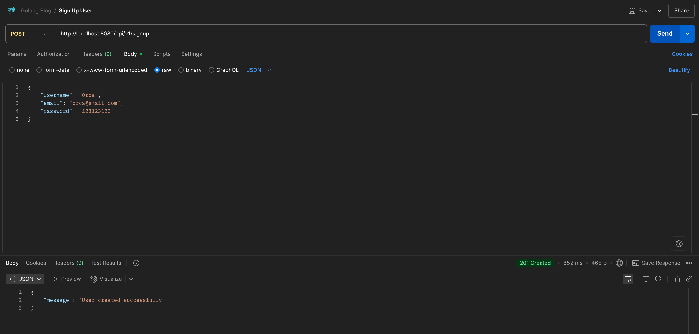
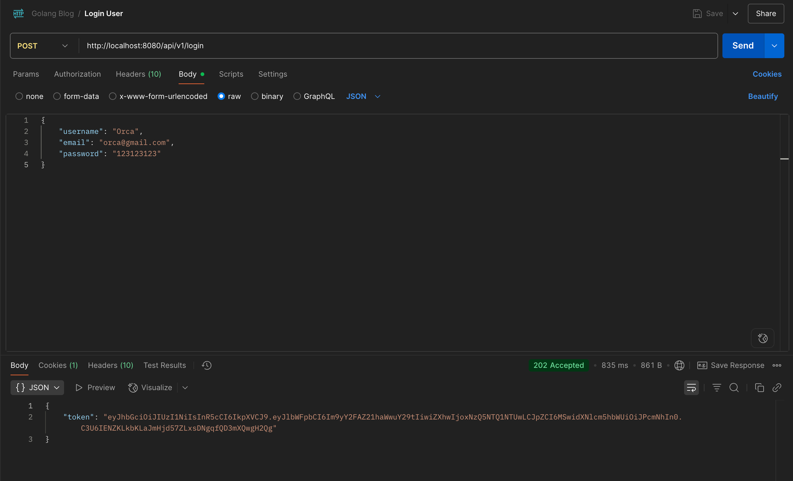
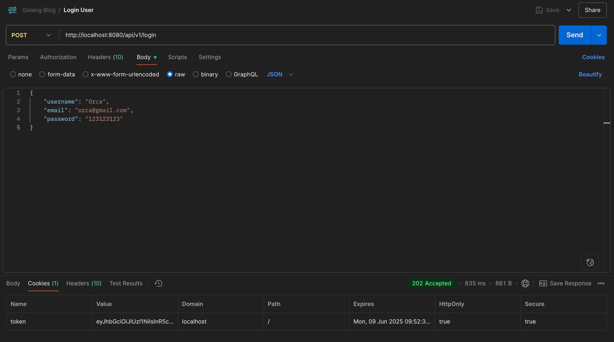
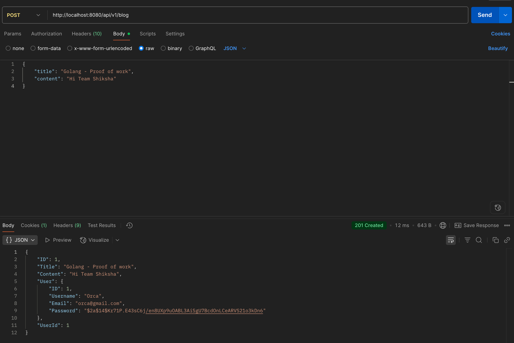
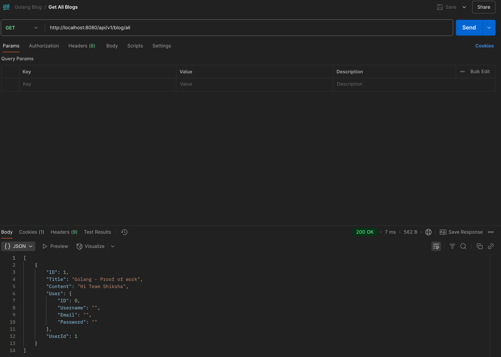
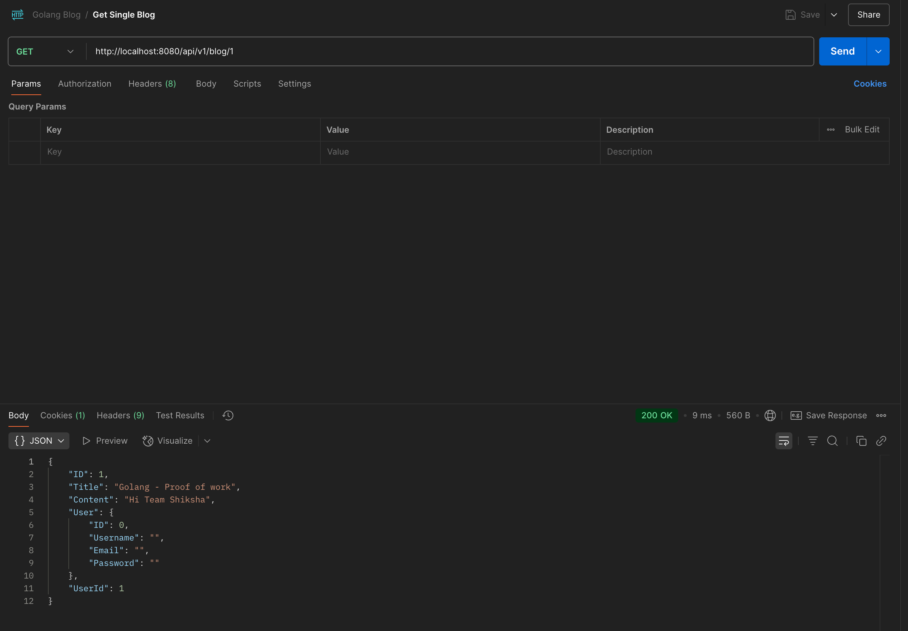

# Team Shiksha - Golang Proof of Work

#### Blog app backend using Golang

##### Summary

This is a backend REST API project built with Golang to demonstrate core web development concepts and best practices. The application implements a blog platform with user authentication and blog post management.
I built it for learning purposes.

Key Features:
- User Authentication (Signup/Login) with JWT tokens
- Blog Post Management (Create, Read)
- Protected routes with Auth Middleware
- CORS support for cross-origin requests
- PostgreSQL database with GORM ORM

The project serves as a learning exercise for:
- Building REST APIs with Golang
- Implementing authentication and authorization
- Working with databases using ORMs
- Structuring a maintainable Go web application
- Following Go best practices and conventions

##### 🚀 Tech Stack

- **Language:** Go 1.24.2
- **Web Framework:** [labstack/echo v4.13.4](https://github.com/labstack/echo)
- **Database:** PostgreSQL (using [jackc/pgx v5.7.5](https://github.com/jackc/pgx))
- **ORM:** GORM (add as needed)
- **Authentication:** [golang-jwt/jwt/v5 v5.2.2](https://github.com/golang-jwt/jwt)
- **Environment Variables:** [joho/godotenv v1.5.1](https://github.com/joho/godotenv)
- **Validation:** [go-playground/validator/v10 v10.27.0](https://github.com/go-playground/validator)
- **Password Hashing:** [golang.org/x/crypto v0.38.0](https://pkg.go.dev/golang.org/x/crypto)
- **Testing:** [stretchr/testify v1.11.1](https://github.com/stretchr/testify)

> **Note:** All dependencies are managed via Go modules. See [`go.mod`](./go.mod) and [`go.sum`](./go.sum) for the full list and versions.

##### Setup and Installation

1. Clone the repository
    ```bash
    git clone https://github.com/dhanushd-27/blog_go.git
    ```

2. Install dependencies (as defined in `go.mod`)
    ```bash
    go mod download
    ```

3. Set up environment variables
    - Note: `JWT_SECRET` field shouldn't be empty
    ```bash
    cp .env.example .env
    # Configure your environment variables
    ```

4. Run the application
    ```bash
    go run main.go
    ```

##### Project Structure

- `controllers/`  
  Request handlers and logic

- `db/`  
  Database connection logic

- `helper/`  
  Utility and helper functions (e.g., CORS handler, JWT auth handler, API server handler)

- `middleware/`  
  Auth middleware

- `models/`  
  Contains user and blog models

- `routes/`  
  User routes and blog routes

##### Data Models

- **User**
  - User model contains ID, username, email, and password

- **Blog**
  - Blog model has ID, Title, Content, and UserID for reference

#### Images of Testing the app using Postman

##### User Signup


##### User Login


##### User Login Set Cookie


##### Creating a Blog


##### Fetch all blogs


##### Fetch a blog with Id
