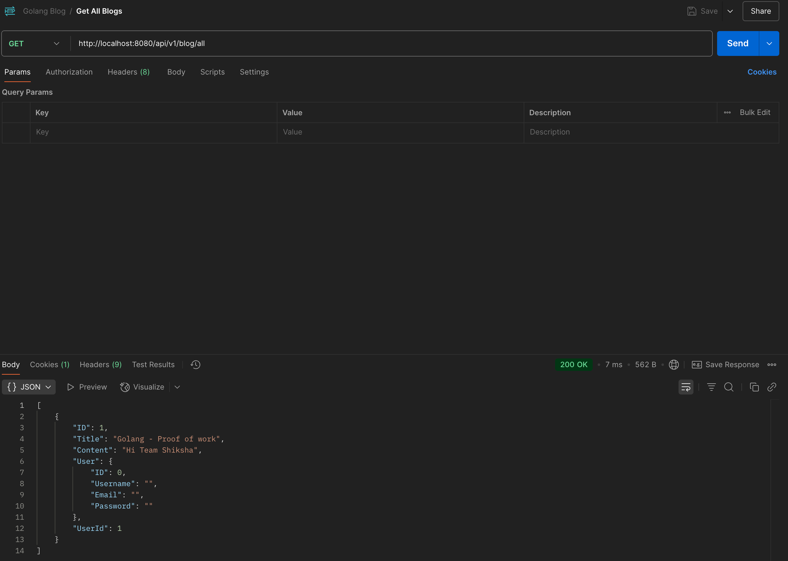

# Team Shiksha - Golang Proof of Work

#### Blog app backend using Golang

##### Summary

This is a backend REST API project built with Golang to demonstrate core web development concepts and best practices. The application implements a blog platform with user authentication and blog post management.
I built it for learning purpose.

Key Features:
- User Authentication (Signup/Login) with JWT tokens
- Blog Post Management (Create, Read)
- Protected routes with Auth Middleware
- CORS support for cross-origin requests
- PostgreSQL database with GORM ORM

The project serves as a learning exercise for:
- Building REST APIs with Golang
- Implementing authentication and authorization
- Working with databases using ORMs
- Structuring a maintainable Go web application
- Following Go best practices and conventions

##### 🚀 Tech Stack

- **Language:** Go 1.24.2
- **Framework:** Gorilla Mux (HTTP Router)
- **Database:** PostgreSQL with GORM (ORM)
- **Authentication:** JWT (JSON Web Tokens)
- **Environment Variables:** godotenv
- **Password Hashing:** golang.org/x/crypto


##### Setup and Installation

1. Clone the repository
```bash
git clone https://github.com/dhanushd-27/blog_go.git
```

2. Install dependencies
```bash
go mod download
```

3. Set up environment variables
  - Note: JWT_SECRET field shoudn't be empty
```bash
cp .env.example .env
# Configure your environment variables
```

4. Run the application
```bash
go run main.go
```

##### Project Structure

- controllers/
  - Request handlers and Logic

- db/
  - Database connection logic

- helper/
  - Utility and helper functions i.e (Cors Handler, JWT Auth Handler, Api Server Handler)

- middleware/
  - Auth middleware

- models/
  - Contains user and blog model

- routes
  - User routes and Blog routes are present here

##### Data Models

- **User**
  - User model contains ID, username, email and password

- **Blog**
  - Blog model has Id, Title, Content and UserId for reference

#### Images of Testing the app using postman

##### User Signup


##### User Login


##### User Login Set Cookie


##### Creating a Blog


##### Fetch all blogs


##### Fetch a blog with Id
